Oftentimes when we work with Git repositories, we want to make changes to the repository on our local machine rather than directly on GitHub. This is especially true when we are working with larger files or more complex changes. In this session, we will learn how to clone a repository from GitHub to our local machine, make changes, and push those changes back to GitHub.

## Cloning and local repositories
<iframe class="slide-deck" src="../../slides/cloning.html" width="900" height="600">

</iframe>

## Working in GitHub Desktop - Tutorial

To get a bit more experience working with GitHub repositories, we are going to clone our tutorial repository, create a repository in GitHub Desktop, make a commit, and push our changes up to GitHub.

### Step 1: Log into GitHub

If this is your first time using GitHub Desktop, you will need to log in to your GitHub account. Open a browser window to GitHub, and make sure you're logged in to your GitHub account. If you are on the NMFS GitHub Enterprise Cloud, you will also need to be logged in using SSO.

### Step 2: Open GitHub Desktop and clone a repository

On your local computer, open GitHub Desktop. Click "Clone a repository from the Internet..."

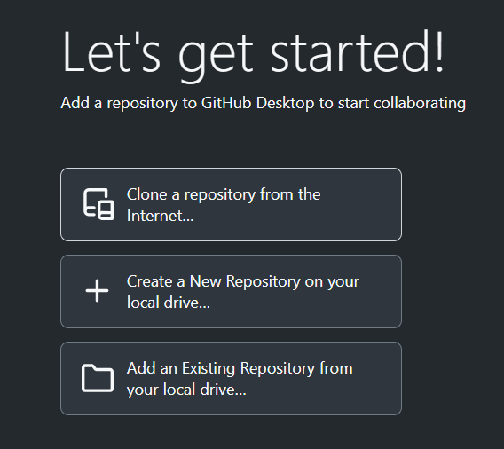

Click "Sign in" and "Continue with browser" to open a browser window and sign into GitHub Desktop.

::: callout-important
## When logging into GitHub Desktop for the first time, you will be presented with a tabbed window as shown below. To access GitHub Enterprise, do not use the Enterprise tab on the login window! This is for a locally-hosted GitHub Enterprise server. The NMFS GitHub Enterprise is cloud-hosted, so to access enterprise repositories from GitHub Desktop, you will need to be logged into the enterprise (via SSO) through your browser.

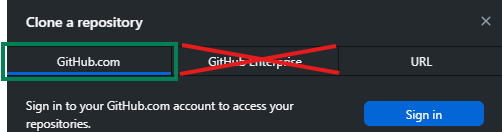
:::

Enter the name of the GitHub Skills repository we just finished (skills-introduction-to-github) into the search box. Select the repository, choose where to clone the repository to on your local machine, and click "Clone".

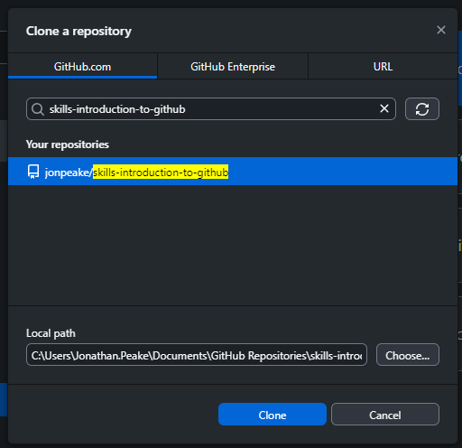

::: callout-tip
## Where should you clone your repository to?

For transient repositories (i.e., repositories that you only plan to work on briefly or occasionally), I suggest creating a folder on your local file system just for these GitHub repositories. If you're working on a project and already have a file folder structure for that project, you can clone and/or create your repository inside the existing folder structure.
:::

### Step 3: Create a new repository

Click the dropdown where it says "Current repository" in the upper left corner of GitHub Desktop. This will bring up a list of your repositories available on your local machine. For those who are new to GitHub Desktop, this should only include our GitHub Skills repository. Click the "Add" dropdown menu, and click "Create new repository..."

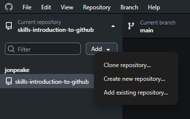

There are several aspects of a repository you will need to keep in mind when creating a new one from scratch:

- **Name**: Make your name distinct and descriptive, but not too long. Don't use spaces (remember, this will be included as part of the URL). Git and GitHub repositories often use [kebab case](https://developer.mozilla.org/en-US/docs/Glossary/Kebab_case).

- **Description**:Add a brief description to your repository that describes its purpose

- **Local path**: Similarly to when you clone a repository into a folder, you need to tell GitHub Desktop where to start a new repository. This will autofill to the directory you specified when installing GitHub Desktop for the first time, but you are welcome to change it to wherever you want your repository stored on your local computer. You can always move a repository after creation.

- **README file**: It is always a good idea to initialize the repository with a README file. This file will serve as the "front page" of your repository on GitHub. You can add a more detailed description of the repository, what it will be used for, instructions for how it should be used by others, etc. If your repository contains datasets, you can also use the README to add metadata. [See this link for more information on README files](https://docs.github.com/en/repositories/managing-your-repositorys-settings-and-features/customizing-your-repository/about-readmes).

- **Git ignore**: A .gitignore file tells Git what files and folders to *not* track. These files will still reside on your local repository, but will not be included in a Commit action or accessible on GitHub. Typically, these files are system files for the coding language or IDE you're using, but can also include files that you don't want to be shown on GitHub. This may include things like data files that are too big or too sensitive to be hosted on GitHub, code files that include sensitive material, and scratch or intermediate files. When creating a new repository, you can choose to pre-populate the .gitignore file based on the primary coding language you expect to use most in the repository.

- **License**: Any public-hosted GitHub repository should contain a license for open source use. The latest NOAA recommendation is to use **Apache License 2.0**

Go ahead and fill in the fields and Create your repository.

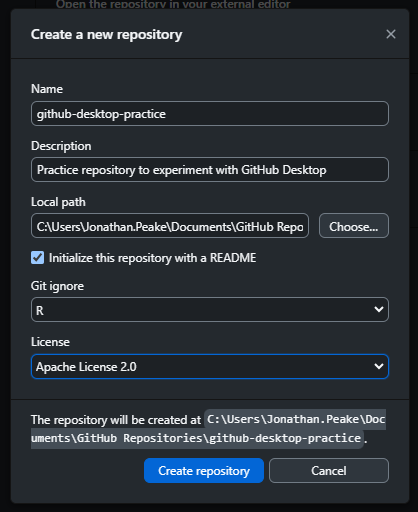

### Step 4: Publish your repository to GitHub

After creating your repository, GitHub Desktop will open it automatically. However, at this point your repository is only available on your local machine. Go ahead and click the button to publish your repository to GitHub.\
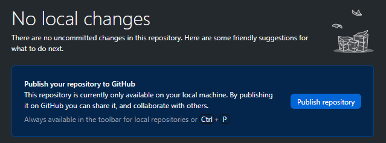

You can choose whether to keep your repository private or let it be viewed by the public. You can also choose to publish the repo to your personal account, or to an organization (e.g., your center's Enterprise account). In general, for the sake of open science we normally suggest keeping a repository public unless it contains sensitive or proprietary data. For now, we'll keep this practice repo public.

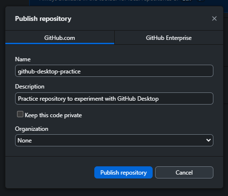

### Step 5: Modify the README file in your repository

You can now open your repository in an editor or IDE (e.g., RStudio), show the files in a file explorer window, or view the repository on GitHub. We will take advantage of the ability to open the repo in the editor to make a change to our repository's README file.

Open your repository in whatever editor you choose (I have mine configured to use RStudio) by clicking the button in GitHub Desktop.

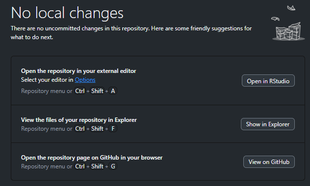

In your editor, open the README.md file. You will notice that the README file is prepopulated with the title of your repository as a first-level header and your brief description. Make a change to your README file (maybe change the title and add a bit more context to the description), and save your changes. Close your editing program.

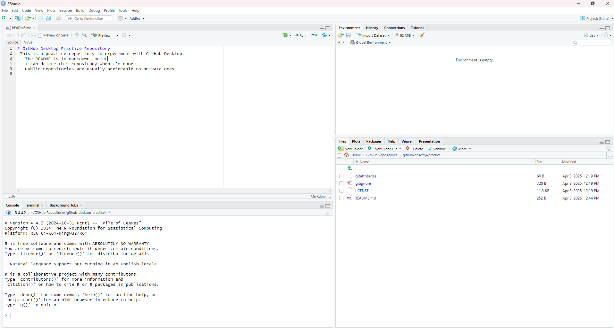

### Step 5: Commit your changes

In GitHub Desktop, you will notice that the README.md file has now been added to the "Changed files" list on the left-hand side, and the changes are shown in the main pane as a series of deletions and additions. The check-marks indicate that those changes are staged and should be included in the commit. If you change your mind and don't want a change to be committed, you can click the check mark and it will change to an "unstaged" state. For now, leave all changes staged.

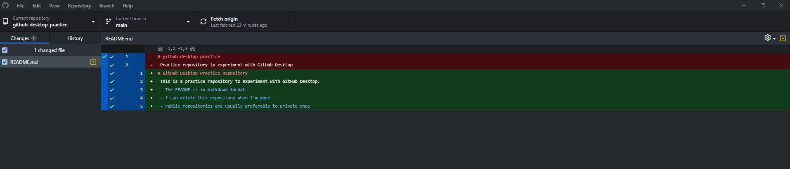

In the bottom left, you will see a box for your commit message and a description. These allow you to describe the changes made in a particular commit. A more descriptive message can help others (and future you) to understand why you made a particular change. GitHub Desktop will prepopulate the message field if you're only modifying one file, but it's often a good idea to change this to something more descriptive. You can go into more details in the description field if necessary, but this is optional.

Change your commit file, and commit to the "main" branch.\
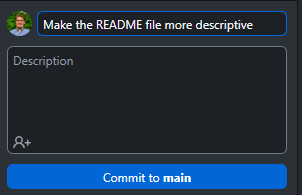

### Step 6: Push your commit to GitHub

After you commit your changes, GitHub Desktop will prompt you to "Push commits to the origin remote". This is how we will get our local changes up on GitHub. Click the "Push origin" button.

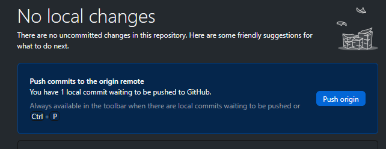

Open the repository in GitHub in your browser to see what the changes we made to our README look like on GitHub.

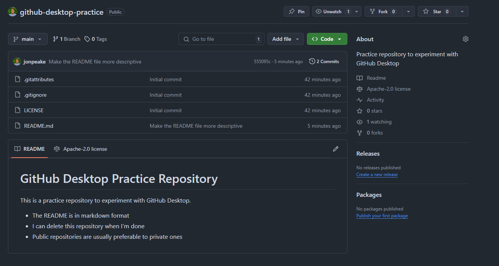

## Demo: Working in other IDEs