GitHub is an important platform for many NOAA Fisheries staff and teams to share and collaborate. In 2023, an Authorization To Use for GitHub Enterprise Cloud was signed, which provides a secure, private, access-controlled and managed platform for staff. In 2024, the GitHub Governance Team (GGT) provided a series of workshops to onboard NOAA Fisheries scientists to GitHub Enterprise and provide training in the use of Git and GitHub for NOAA Fisheries. In 2025, NMFS Open Science will be leading a second iteration of these workshops to provide NOAA Fisheries staff with the necessary skills to effectively incorporate Git and GitHub into existing workflows.

The GGT has outlined several use cases for why you may want to incorporate Git and GitHub into your workflows:

- Development and distribution of scientific products and fundamental research communications.
- Development of software and statistical packages for data analysis, e.g. stock assessment models.
- Project/team management using GitHub project boards, issue tracking, task tracking.
- Collaborative development of reports that combine data, resource intensive analysis, and text.
- Automated report generation (using connection to online database and continuous integration).
- Educational resources and learning activities.

## Aims and Objectives

This session will use a mixture of directed, interactive lessons and GitHub Skills to provide NOAA Fisheries staff with the knowledge required for basic repository management using Git commands, collaboration, and project management.

## Prerequisites: What do I need before this workshop to follow along on my own?

1.  [Create a GitHub account](https://nmfs-opensci.github.io/GitHub-Guide/#create-a-github-user-account)
2.  [Install GitHub Desktop](https://desktop.github.com/download/) - Note that this will also install Git on your machine
3.  Request access to NMFS GitHub Enterprise Cloud (NMFS staff and affiliates only)
    a.  [Download the NMFS GitHub Enterprise Cloud user agreement](https://drive.google.com/file/d/1yP0mLpD5d5rsgNv5-_Z6OWpwhLROjxMg/view)
    b.  Use [this Google form](https://docs.google.com/forms/d/e/1FAIpQLScvWB-gTtQKlFPdyt3Y_H_oya9EW6Nj-56jsWJsxVdT8RJwHw/viewform) to request access to Enterprise
    c.  Wait for follow-up email and [confirm you're a member](https://github.com/enterprises/noaa-nmfs) (if you see a 404 page you haven't been added yet)
4.  Log into GitHub and GitHub Desktop using your GitHub account credentials

## Why Git/GitHub?

<iframe class="slide-deck" src="../../slides/why_git.html" width="900" height="600">

</iframe>

## GitHub Enterprise

<iframe class="slide-deck" src="../../slides/ghec.html" width="900" height="600">

</iframe>

## Git and GitHub: The basics

<iframe class="slide-deck" src="../../slides/git_basics.html" width="900" height="600">

</iframe>

## Introduction to GitHub - Tutorial

[GitHub Skills - Introduction to GitHub](https://github.com/skills/introduction-to-github)

We'll be using the Introduction to GitHub Skills Tutorial to get our feet wet with Git and GitHub. Follow along with the tutorial using your personal GitHub account.

### Step 1: Copy the exercise

Open the GitHub Skills link, and make sure you are logged into GitHub. Use the "Copy Exercise" button to make a new repository on your account:

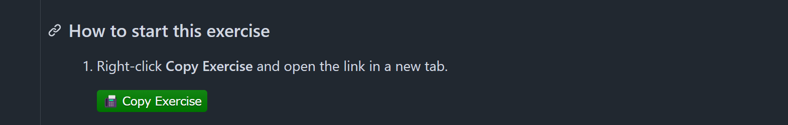{width="634"}

When you open up the "Copy Exercise" link, you will be presented with the "Create a new repository" interface. Keep all of the defaults, and click the green "Create repository" button: 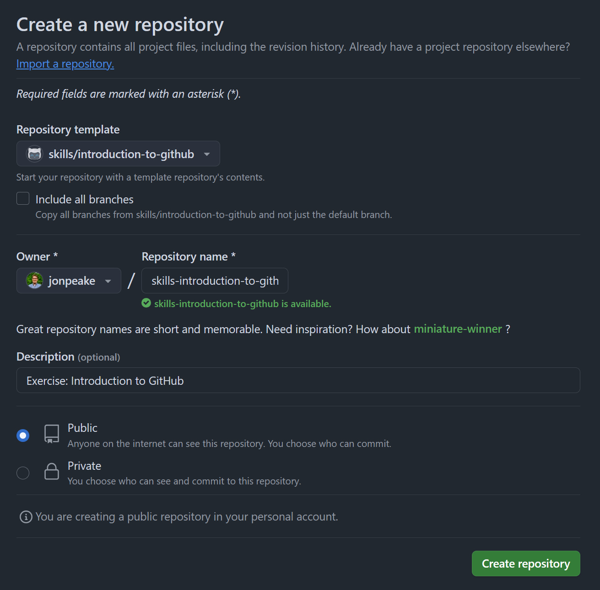{width="617"}

::: callout-important
## GitHub Skills tutorials use GitHub Actions in the background.

These actions use "minutes", which are limited in a private repository, but unlimited in a public one. We suggest keeping your GitHub Skills tutorial repositories public to avoid any minutes limitations.
:::

::: callout-tip
## You'll notice that most steps in a GitHub Skills tutorial feature a message to wait about 20 seconds for the exercise to update.

GitHub Actions can take a little bit of time to run, so waiting this requisite time is important! Refresh the instructions after 20 seconds to make sure everything updates properly.
:::

### Step 2: Start the exercise

After waiting the suggested 20 seconds, refresh the instructions page. You'll notice that the "Copy Exercise" button has switched from green to gray, and the "Start Exercise" button has switched from gray to green.

Right click the "Start Exercise" button and open it in a new tab. This will open an Issue for this repository that will serve as the instructions for the exercise.

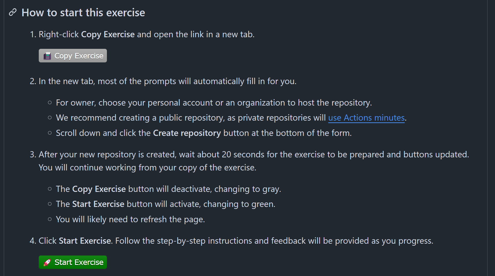{width="631"}

::: callout-tip
## I suggest moving the instructions tab into another window so you can work side-by-side with the instructions to limit switching back and forth between tabs. 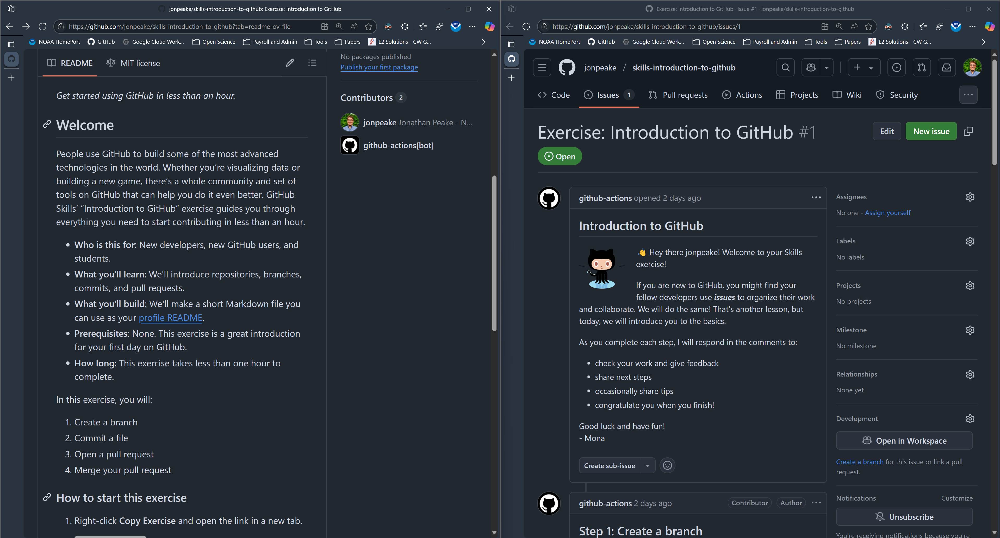
:::

### Step 3: Follow the exercise

#### Create a new branch

Create a new branch following the instructions in the tutorial:\
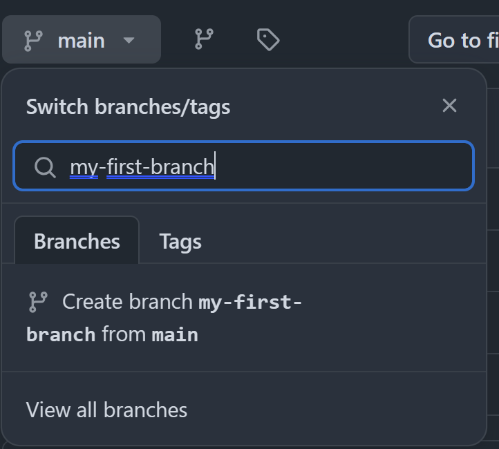{width="491"}

::: callout-note
## If you have the instructions open in side-by-side mode, you may notice that the github-actions bot will be producing new comments in the instructions.

Be sure to wait until the bot is finished before starting the next part of the exercise!
:::

#### Create a commit with a new file

Click the "Add file" button to create a new file named `PROFILE.md`

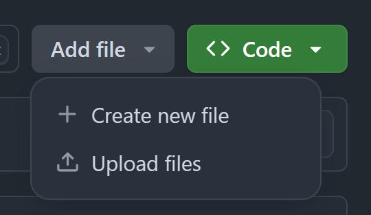{width="277"}

::: callout-tip
## If you've arranged your screen in a side-by-side mode, the "Add file" button may look a bit different!

GitHub dynamically shortens certain buttons and tabs based on the size of the window. In this case, the "Add file" button becomes the "+" button:

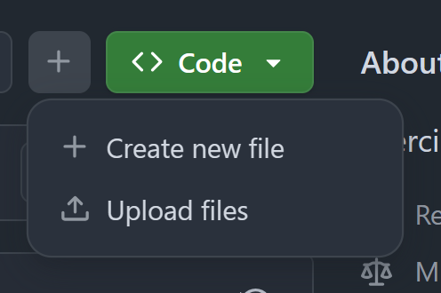{width="253"}
:::

Add a line to the new file, and click the "Commit changes" green button:

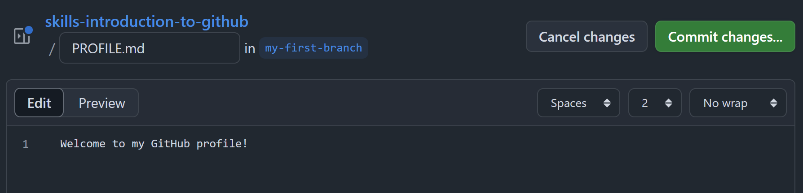{width="759"}

Change the "Commit message" to "Add PROFILE.md" and click "Commit changes" to confirm the commit

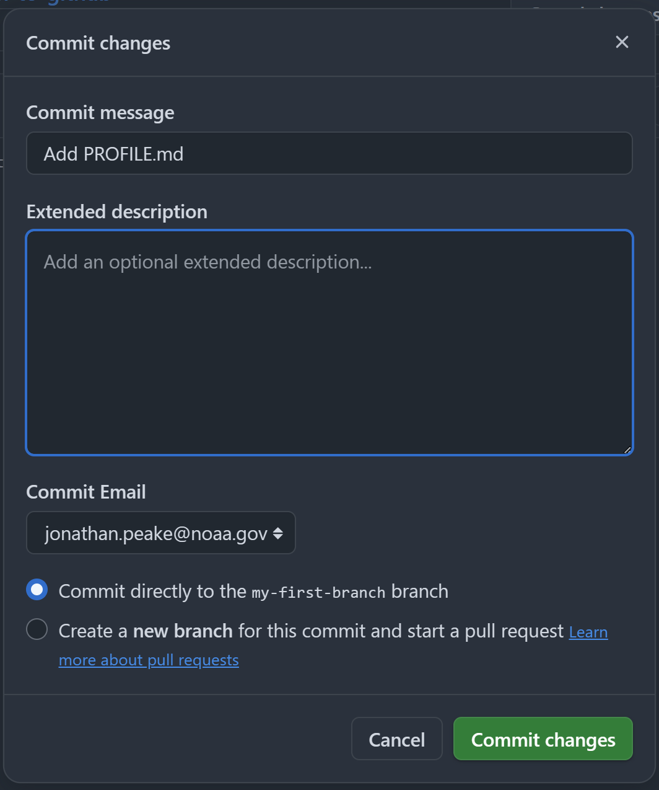{width="669"}

#### Open a pull request

Refresh the repository and click the "Compare & pull request" button.

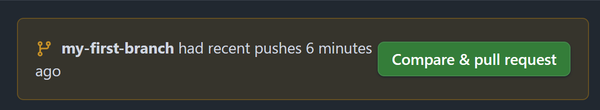{width="543"}

Edit the title field to read "Add my first file", and provide a brief description of your pull request. Click "Create pull request"\
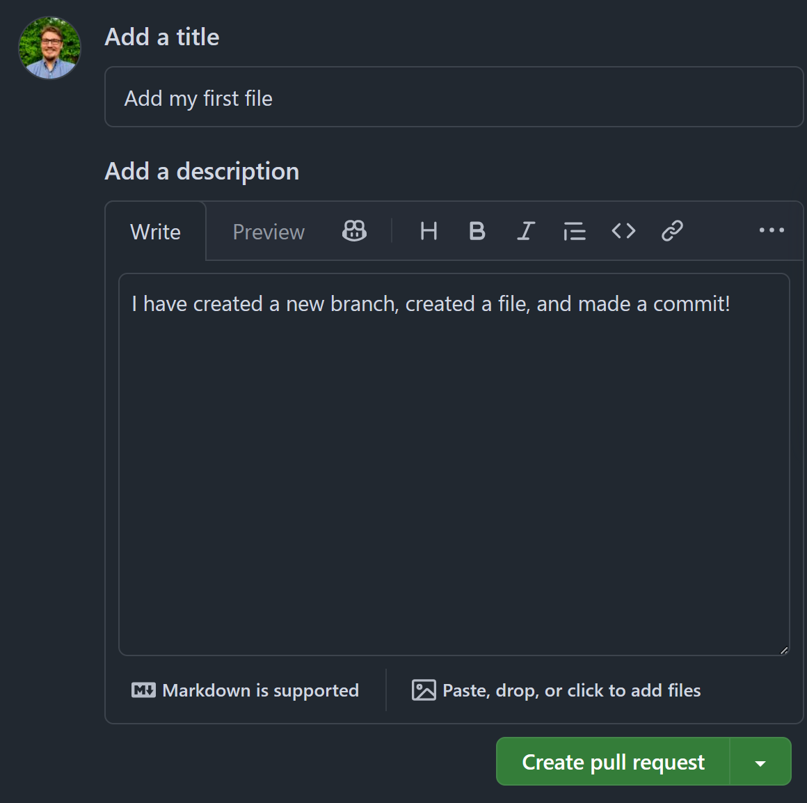{width="596"}

::: callout-tip
## You can follow the progress of the GitHub Actions running in the background after this step!

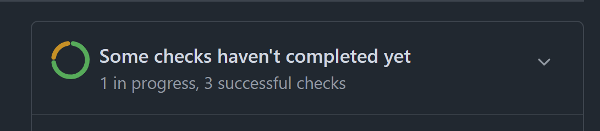{width="447"}
:::

#### Merge the pull request

Click the green "Merge pull request" button, and confirm the merge. Delete the branch after merging (don't worry, you can always restore a deleted branch)\
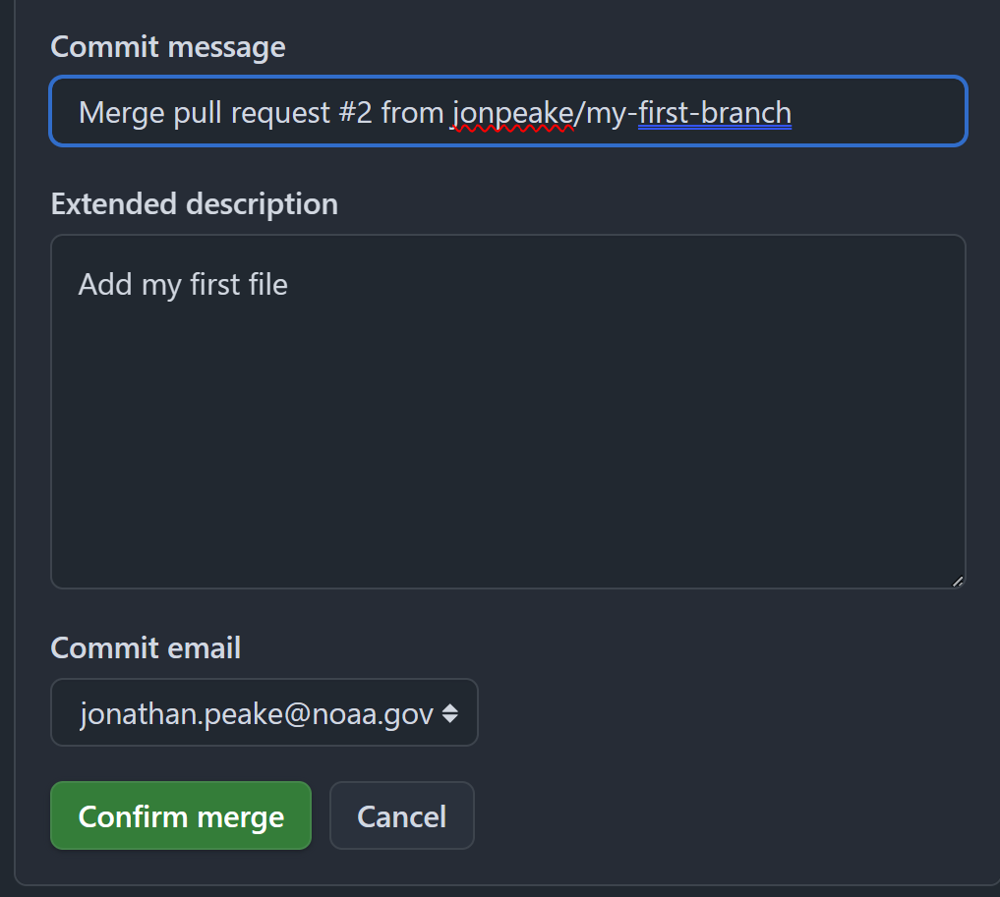{width="527"}