Communication among developers and between developers and end users is a key aspect of GitHub that promotes collaboration and open source development. GitHub provides a number of tools and features to facilitate communication. Two of these features, GitHub Issues and GitHub Discussions, allow collaborators to create, discuss, and track work in a repository. GitHub Projects allow teams to plan and track work in a repository and across repositories. This skills session will use directed, interactive lessons to provide NOAA Fisheries staff with a foundation in using Issues, Discussions, and Project Boards to promote open source development in GitHub.

## GitHub Issues and Discussions for Project Development

<iframe class="slide-deck" src="../../slides/issues.html" width="900" height="600">

</iframe>

## Project Management in GitHub

<iframe class="slide-deck" src="../../slides/projects.html" width="900" height="600">

</iframe>

## Tutorial: Working with issues and discussions

For this tutorial, we're going to be forking a demo repository (<https://github.com/nmfs-opensci/GitHub-Clinic-demos>), enabling Issues and Discussion on our repository, and adding an issue and a discussion to the repository. Follow along on your own account.

### Step 1: Fork the repository

::: callout-tip
## If you have already forked this repository for a previous session, you can skip this step.

We have used this demo repository for previous GitHub Clinic demonstrations and tutorials, so you may already have a forked copy of this repository on your account. If you are unsure, you can search for **`[your-username]/GitHub-Clinic-demos`** in the GitHub search bar.
:::

1.  Open [the demo repository](https://github.com/nmfs-opensci/GitHub-Clinic-demos) in GitHub.\
    
2.  At the top of the repository, click the **Fork** button.\
    
3.  Keep everything default (your account should be listed under **Owner**, and the **Repository name** should be pre-filled for you). Click the green **Create Fork** button.\
    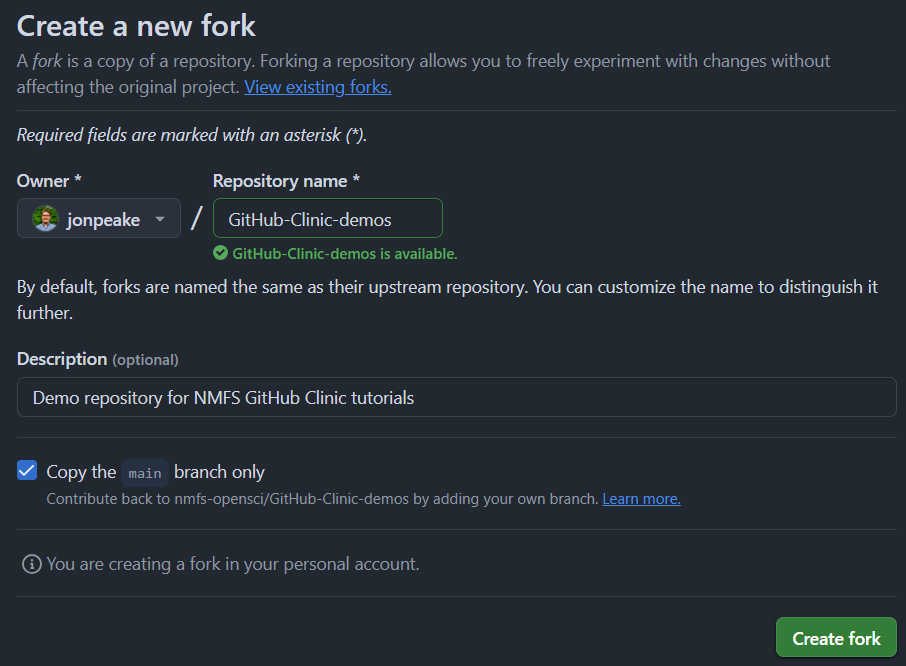

### Step 2: Enable Issues and Discussions

When you create your new fork, you may notice that the **Issues** and **Discussions** tabs that you normally see at the top of the repository are not there. We have to enable these in the repository settings.

1.  Navigate to the **Settings** tab in your forked repository.\
    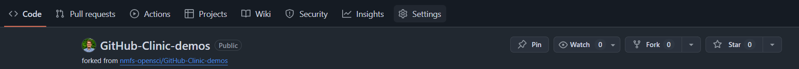
2.  On the main settings page, scroll down to the **Features** section, and select the checkboxes next to **Issues** and **Discussions**.\
    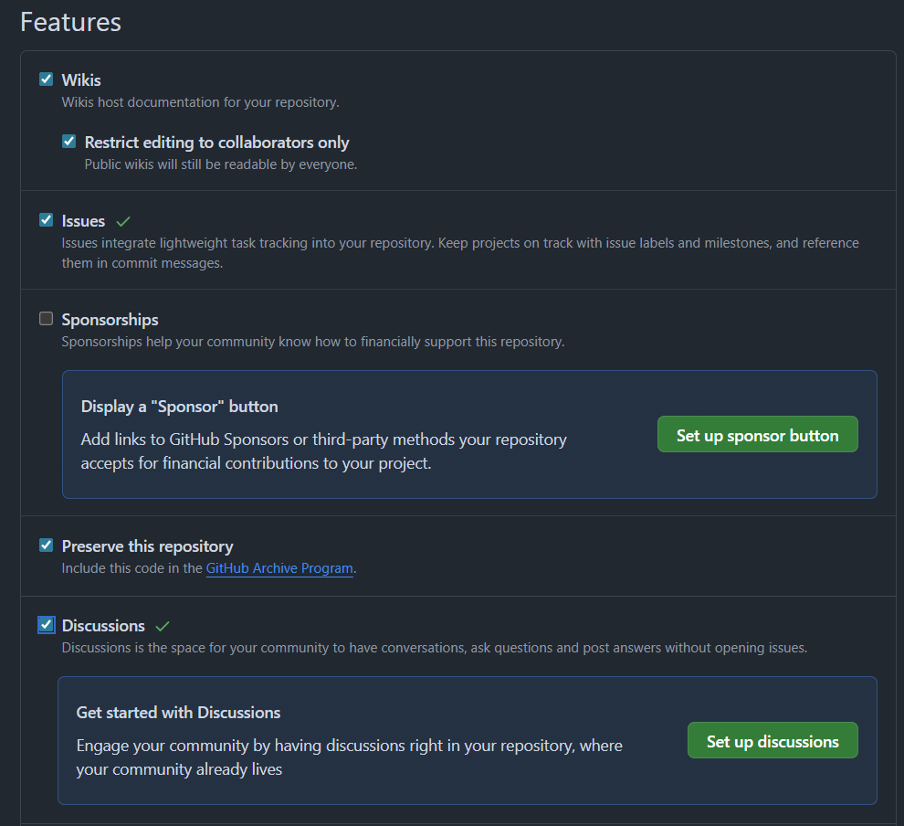
3.  Note that the top menu bar for your repository now has the **Issues** and **Discussions** tabs added.\
    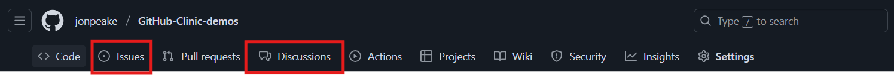

### Step 3: Set up a template issue

1.  Refresh the settings page, and in the same **Features** section, click the green **Set up templates** button under **Issues.**\
    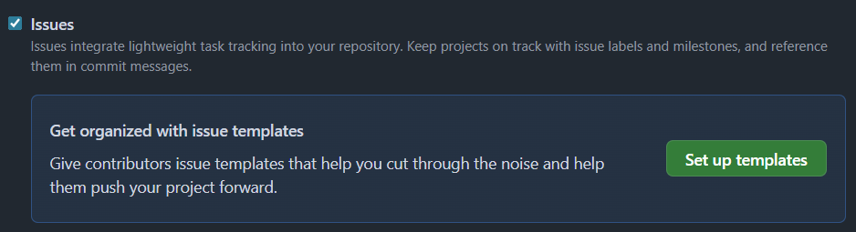
2.  Under the dropdown menu for **Add template**, select **Bug report** to add a Bug report template to your available templates.\
    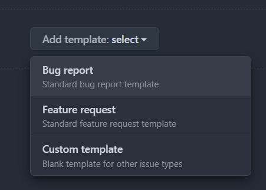
3.  Click the **Preview and edit** button to see what your issue template looks like in Markdown\
    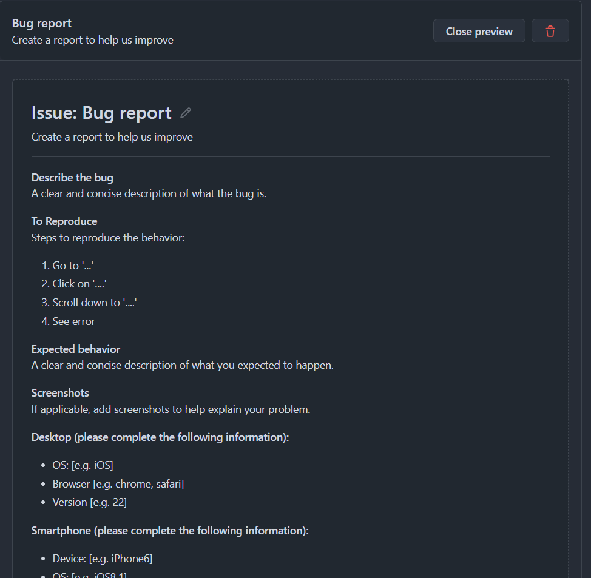
4.  Let's go ahead and edit the template to take out the part about smartphone specifications. Click the edit button at the top next to **"Issue: Bug report"** (it looks like a little pencil).\
    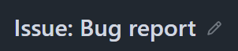
5.  In the **Template content** section, scroll down to the "Smartphone" section, and delete everything from that section.\
    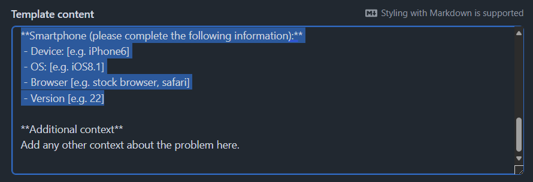
6.  Click the "x" at the top of the editing pane to save your changes, then click the **Close preview** button. Click the green **Propose changes** button to create a commit that will add your new template to your repository.\
    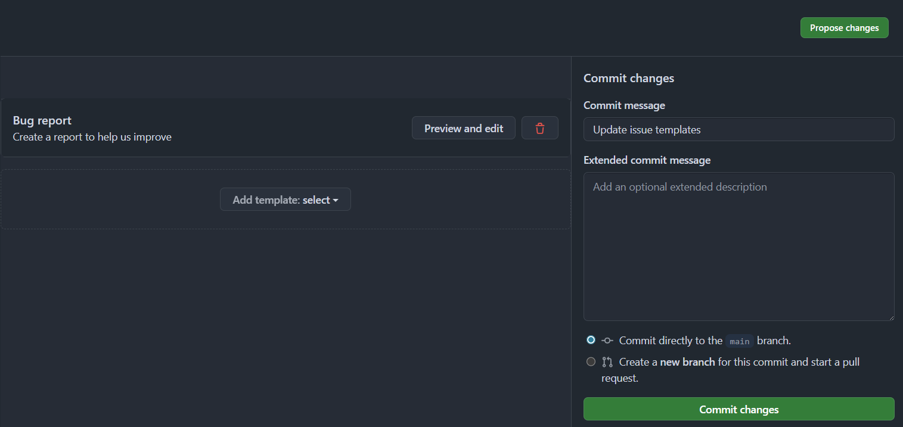
7.  Note that you now have a new subfolder in your repository under the `.github` folder called `ISSUE_TEMPLATE`. If you navigate to that folder in your repository, you can see our newly created `bug_report.md` template. If we ever want to make more edits to our template, we can either use the template editor interface in the **Settings** menu, or we can directly edit these files in our repository.\
    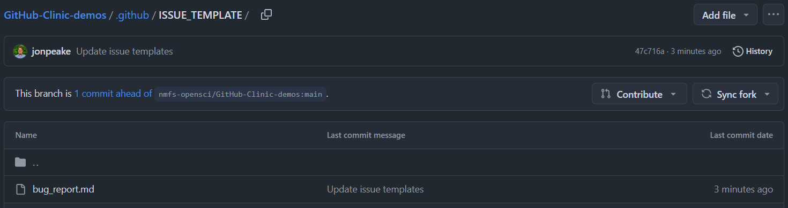

### Step 4: Create an issue

1.  Navigate to the **Issues** tab in your repository, and click the green **New issue** button.\
    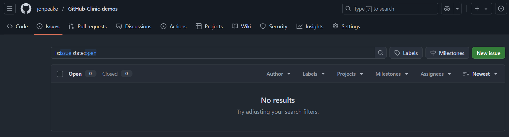
2.  Let's use the new template that we created. Click the **Bug report** option in the menu.\
    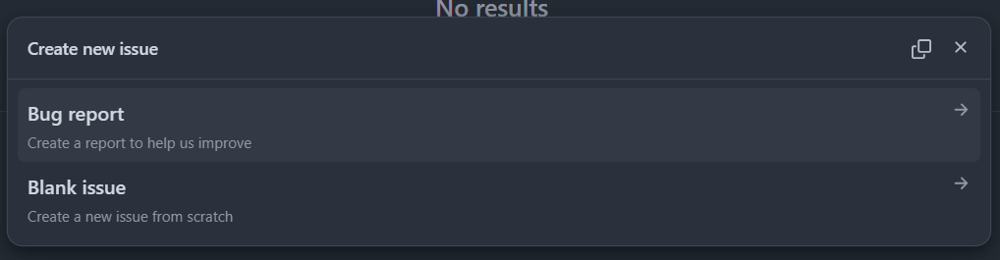
3.  Give your issue a title and fill in the template with a fake "bug". Note that you can directly paste in an image from your clipboard (GitHub converts it to a permalink when you paste it into Markdown). Click the green **Create** button to submit your issue.\
    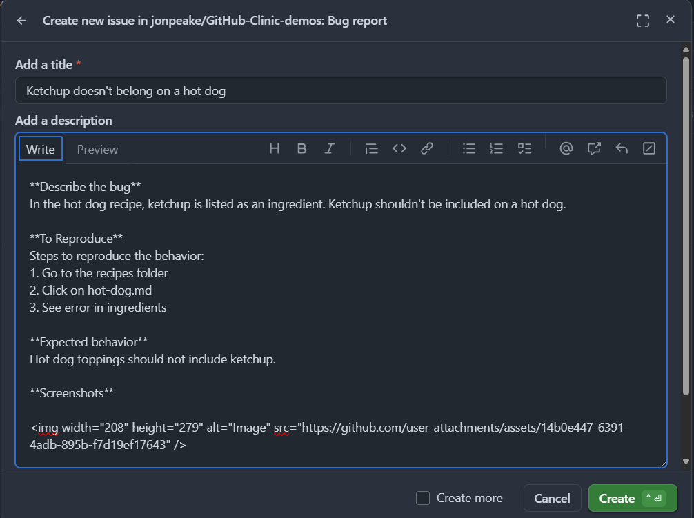
4.  Let's add a label to our Issue to show that it's a bug report. On the left-hand side of the issue, click the "Labels" section and select "bug".\
    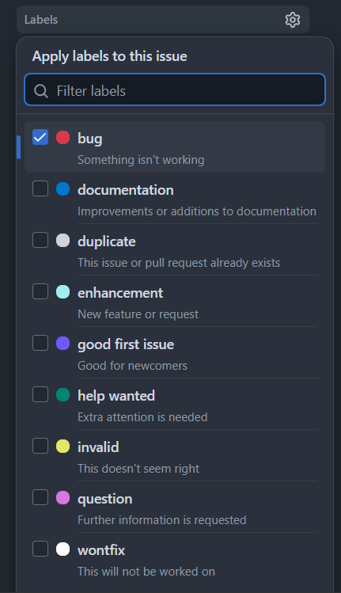

### Step 5: Start a discussion

Our bug report has spawned some discussion among the developers! Let's document this discussion in our repository.

1.  Navigate to the **Discussions** tab in your repository, and click **New Discussion**.\
    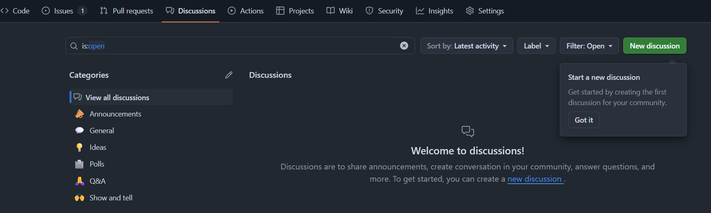
2.  Let's make this a general discussion. Click the green **Get started** button in the area next to **General**.\
    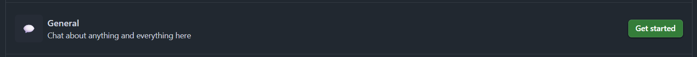
3.  Add a title and a body to your discussion thread. We can reference the issue that we created earlier using the `#` key.\
    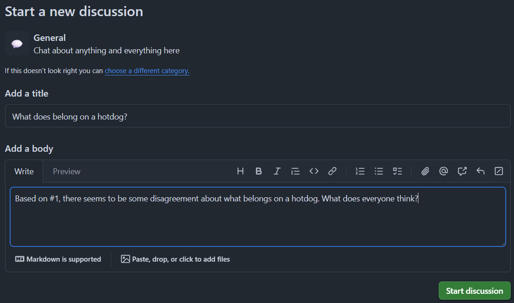
4.  Click the green **Start discussion** button to save your discussion thread.\
    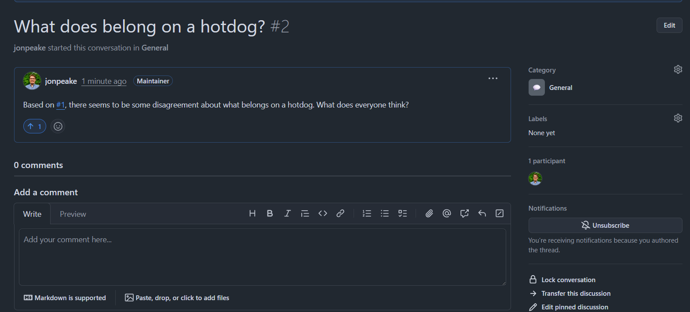
5.  Congratulations! You have now added both an Issue and a Discussion topic to your repository. Feel free to play around with other Issues templates and Discussion types on your own.

## Tutorial: Getting familiar with GitHub Projects

For this tutorial, we're going to be forking a demo repository (<https://github.com/nmfs-opensci/GitHub-Clinic-demos>), enabling Issues, and creating a Project. We will add some issues to our Project, and explore different project views and customization options to tailor our Projects to our specific needs. Follow along on your own account.

### Step 1: Fork the repository

::: callout-tip
## If you have already forked this repository for a previous session, you can skip this step.

We have used this demo repository for previous GitHub Clinic demonstrations and tutorials, so you may already have a forked copy of this repository on your account. If you are unsure, you can search for **`[your-username]/GitHub-Clinic-demos`** in the GitHub search bar.
:::

1.  Open [the demo repository](https://github.com/nmfs-opensci/GitHub-Clinic-demos) in GitHub.\
    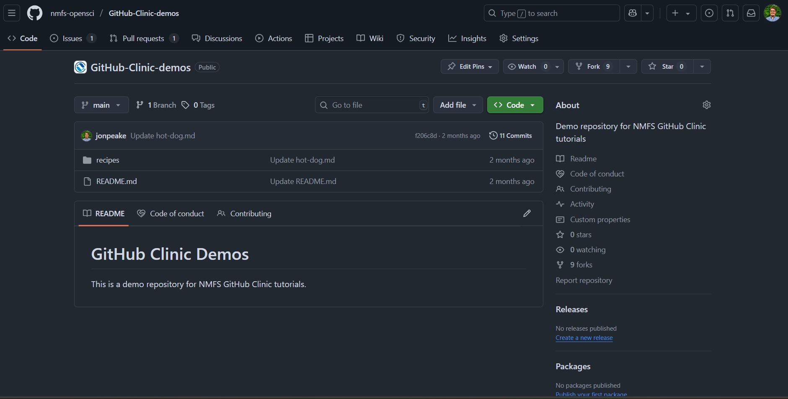
2.  At the top of the repository, click the **Fork** button.\
    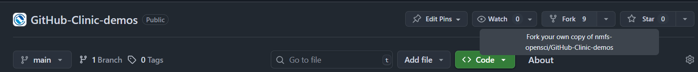
3.  Keep everything default (your account should be listed under **Owner**, and the **Repository name** should be pre-filled for you). Click the green **Create Fork** button.\
    
4.  When you create your new fork, you may notice that the **Issues** tab that you normally see at the top of the repository is not there. We have to enable this in the repository settings. Navigate to the **Settings** tab in your forked repository. Scroll down to the **Features** section and check the box next to **Issues.** (Note that Projects is another option in the **Features** section; this should already be checked, but if it isn't, go ahead and check that as well).\*\*\*\* 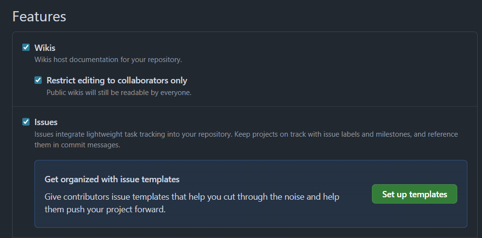

### Step 2: Create a new Project

There are multiple ways to create projects in GitHub. Rather than being attached to one specific repository, Projects can act across any and all repositories in an account. Because of this functionality, Projects reside in either a user's account or an organization's account, rather than within a repository. We're going to be creating a Project using the **Projects** tab within a repository, but keep in mind that we can access all of our Projects from our account home page.

1.  Navigate to the **Projects** tab on the top ribbon bar of your repository. Click the green **New project** button to start a new project.\
    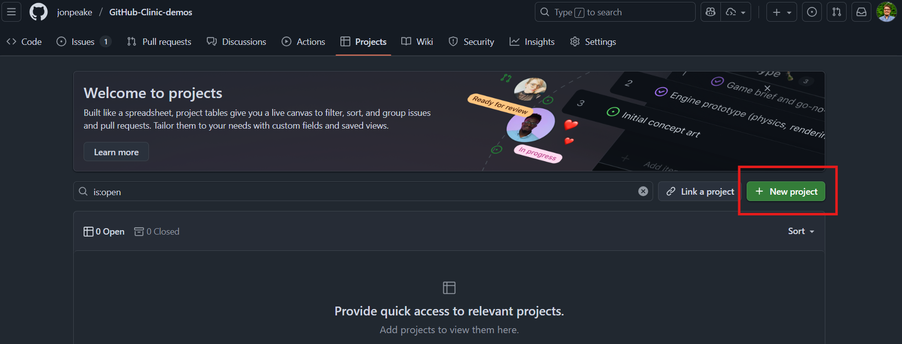
2.  You will be presented with a number of pre-defined Project templates, each of which has a specific layout and customized configuration tailored to the type of planning or tracking your team may use. Feel free to explore these on your own; for now, let's start a project from scratch. On the left-hand side of the pop-up, select the **Table** option under **Start from scratch**.\
    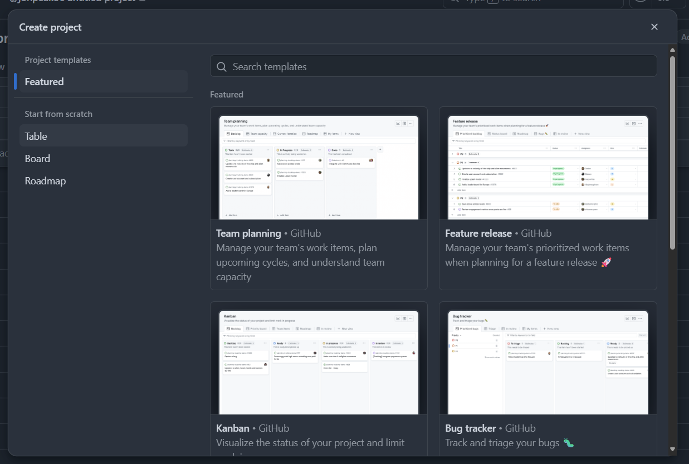
3.  Give your new Project a name. Let's call ours "GitHub Clinic example project". Click the green **Create project** button to finalize your new project.\
    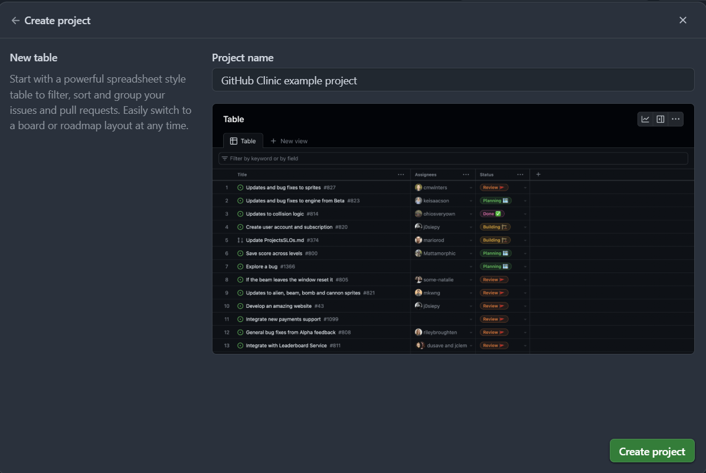
4.  Let's add a description and README to our project to describe our Project's purpose. Click the ellipse button (View more options) at the top right of the project, and select \*\*Settings.\*\* 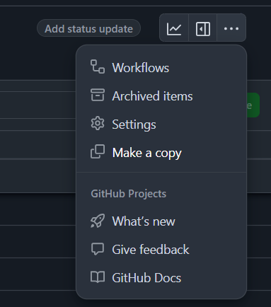
5.  Add a short description and README to the Project to explain the purpose of the Project and how to use it. Note that the README supports markdown formatting. In future Projects, you may want to take advantage of this to flesh out the details of your Project and add more context.\
    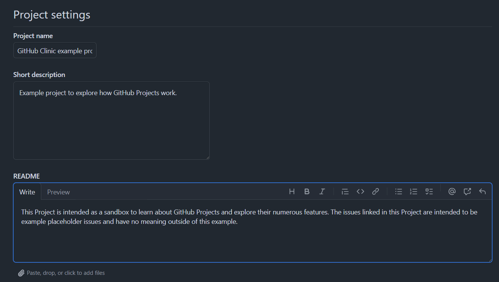

::: callout-note
## GitHub Projects default to Private visibility.

You may have noticed that there's a padlock-style icon next to the title of our Project. This means that the Project is private, so only you and the people you specifically grant access can see the Project. We can change the visibility in this Settings menu as well. Sometimes it's beneficial to make Projects publicly viewable for transparency purposes; otherwise, feel free to keep these Projects private. You can always add collaborators later.
:::

### Step 3: Add items to your project

Let's populate our Project with some issues! We can add existing issues from any repository in the account (individual or organization) that the Project was created under. We can also create our own issues directly from the Project interface.\
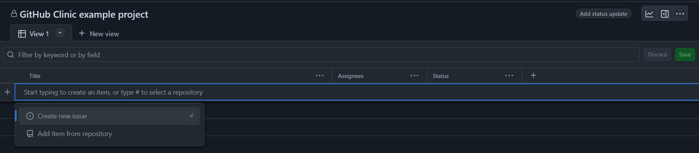

1.  Let's create a few example issues for our Project. Click the `+` button on the first line of the Project board, and click "Create new issue". This will pop up a dialogue box where we can add an issue to a repository. We'll create our issues in the GitHub Clinic Demo repository, so make sure the **Repository** section has the appropriate repository selected (Hint: click the Repository dropdown menu and type "github-clinic-demos" in the search box).\
    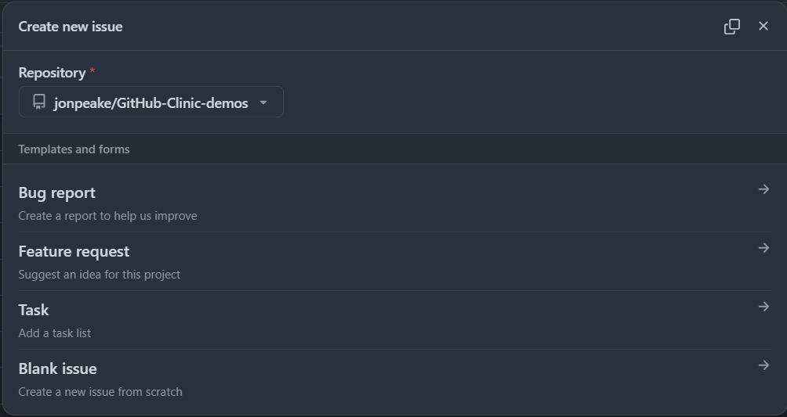
2.  I've added some Issue templates for **Bug report, Feature request,** and **Task** to the demos repository that should transfer to your forked repository. Let's add one of each type to our Project.\
    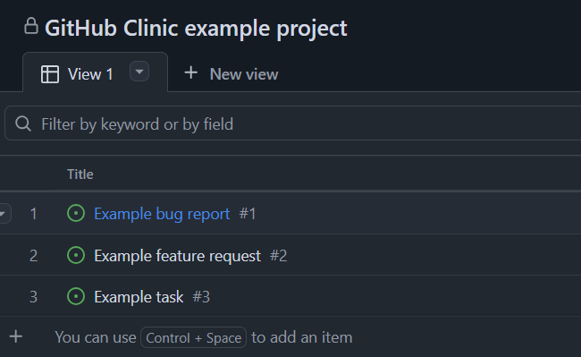

::: callout-tip
## You may need to pull changes from the parent repository to get the appropriate templates.

If you are working from a previously forked copy of the `GitHub-Clinic-Demos` repository, you will need to update your version of the repository with the parent repository hosted on `nmfs-opensci`. On the **Code** tab of your forked copy of the repository, there will be a banner saying your branch is behind the branch hosted on nmfs-opensci. Next to this banner, there should be a button called **Sync fork**. Go ahead and click that button, and select **Update branch**.\
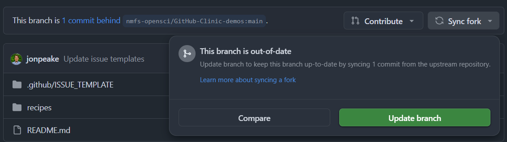
:::

3.  We can also add "draft" issues to our Project. These can be used as placeholders for items that may need to be more fleshed out or items that we don't necessarily need as true "issues" in a specific repository. Click in the Title spot below the last project item, and type in a draft issue.\
    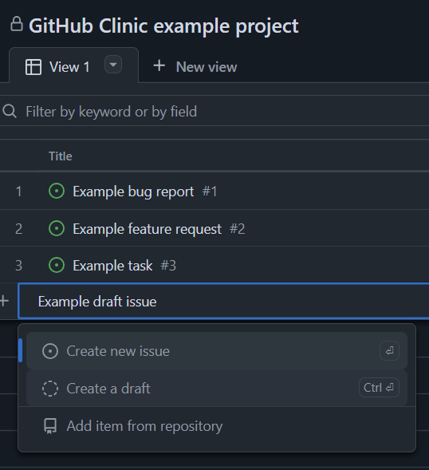

### Step 4: Adding fields

Let's create some custom fields to better organize our project.

1.  Iteration fields let us plan and track our work over repeating blocks of time. Iterations can be configured with customizable lengths and breaks to suit your team's needs. Create an iteration field by clicking the `+` icon to the right of the Status column in our table view, and click "New field". Give your field a name, and change the field type to Iteration. You can customize when the iteration should start and how long each iteration should last.\
    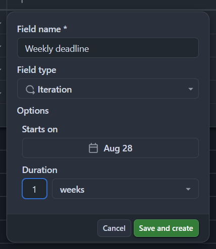
2.  Assign each of your Project items to an iteration. This will be useful when we explore the Roadmap layout later.\
    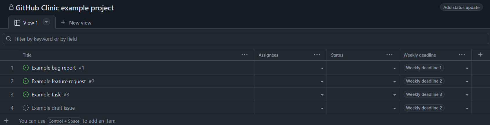
3.  Let's create a Priority field. Click the `+` icon to the right of the Iteration column in our table view, and click "New field". Name your field Priority, and select "Single select" from the field type menu. Add options for Low, Medium, and High priority. Save your new field.\
    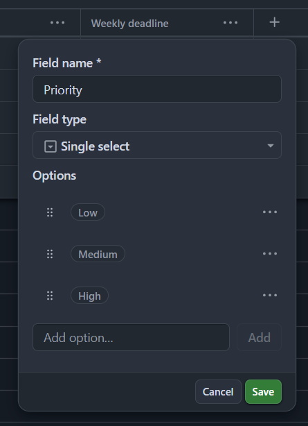
4.  Assign each of your example issues to a priority level in your new field.\
    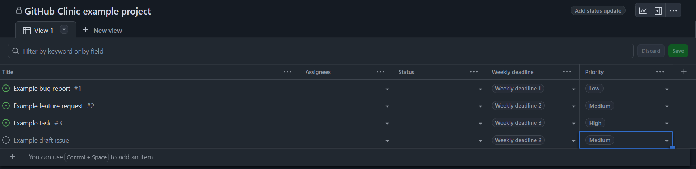

### Step 5: Configure the Table layout

Let's make this table a little more informative by adding some other fields.

1.  Click the dropdown where it says **View 1**, and select the **Fields** menu. Under "Hidden fields", select **Labels, Milestone,** and \*\*Repository.\*\* 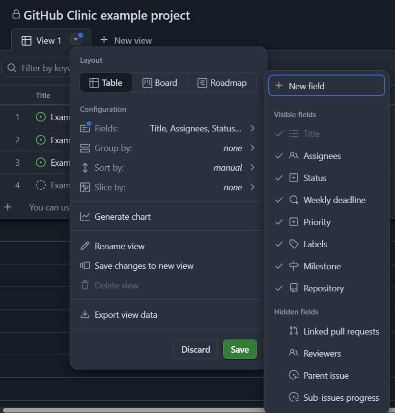
2.  In the same dropdown, select the **Group by** option and select **Priority** to split the table by priority.\
    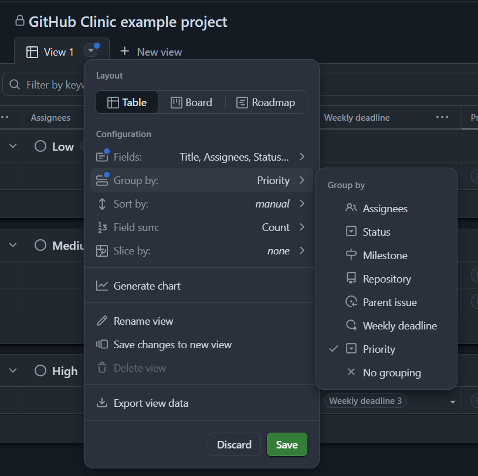
3.  With the grouped view, we can now move items between priorities. Try this out by moving one of your items from medium to low priority. Do this by clicking and dragging from the number to the left of the issue title.\
    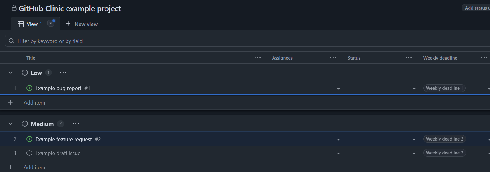\
    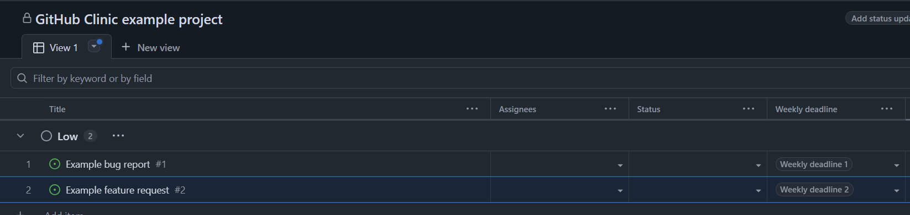
4.  Change the name of your view by clicking the drop-down menu again and selecting **Rename view.** Let's rename it to "Planning".\
    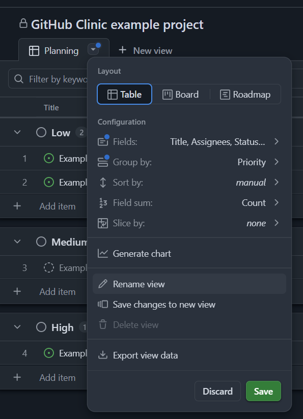
5.  Save your changes to the view by clicking the green **Save** option in the dropdown menu.\
    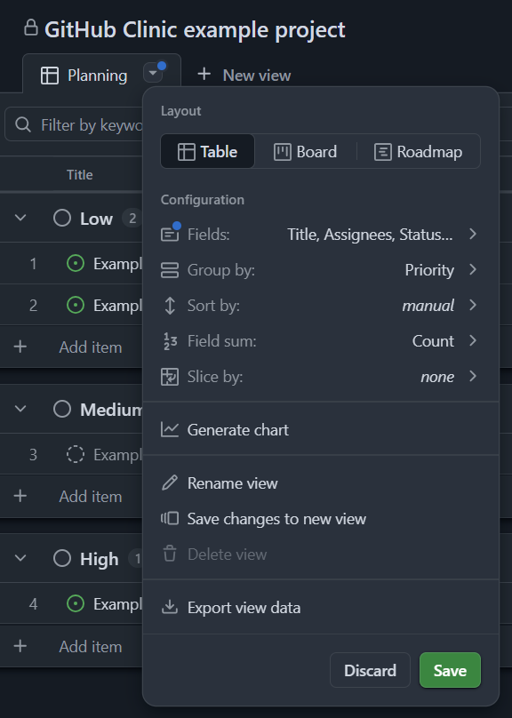

::: callout-caution
## Be sure to save your view if you want to come back to it!

Views do not save to the project by default. If you make changes to a view that you want to be shown every time you open your project, be sure to save them. Otherwise, view changes will only be applied during the current session.
:::

### Step 6: Experiment with other views

Let's create a couple new views to showcase the other view types. You're welcome to play around with these views on your own, but for now we'll just introduce the other view types.

1.  Create a new view by clicking the **+ New view** tab at the top of the project. Select the **Board** option.\
    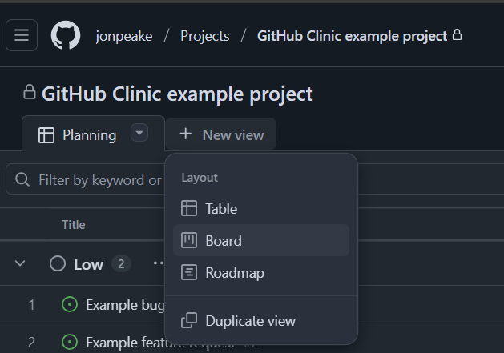
2.  Rename this view to "Progress Board", and click the green **Save** button to save your view. Here we can move issues between different categories. The default is a traditional kanban-style board with statuses for level of completeness. However, we can also add different categories to assign and organize issues to whatever is needed. We can even add multiple versions of these boards to categorize items in different ways.\
    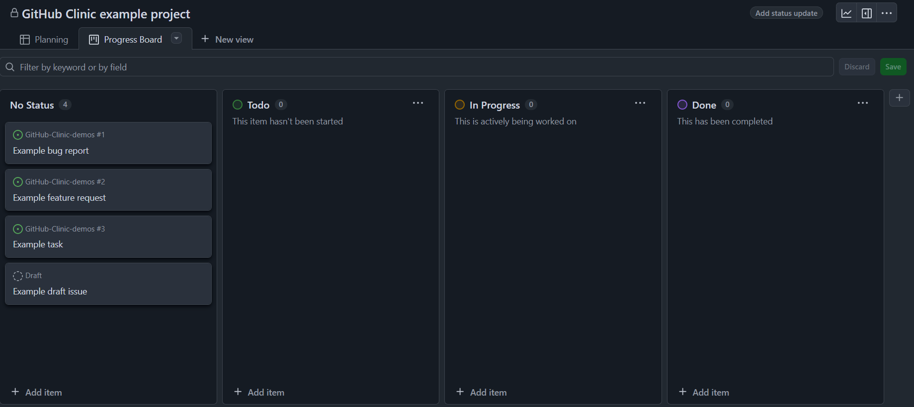
3.  Now let's add a timeline view. Select **+ New view** at the top of the project, and select the **Roadmap** option.\
    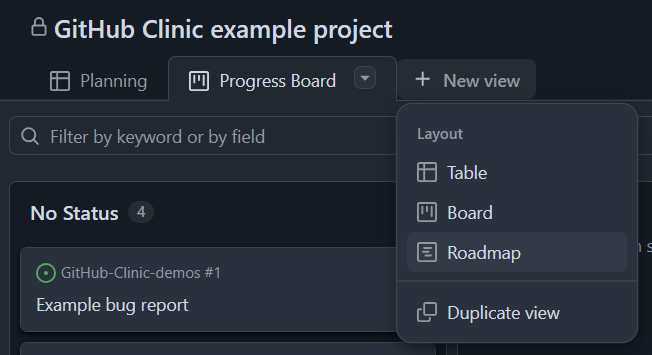
4.  GitHub will prompt us that we need a date field set for this view. Recall that we set up an Iteration field earlier in the exercise called **Weekly deadline.** Choose the **Weekly deadline start** option for the **Start date** and **Weekly deadline end** option for the **Target** date.\
    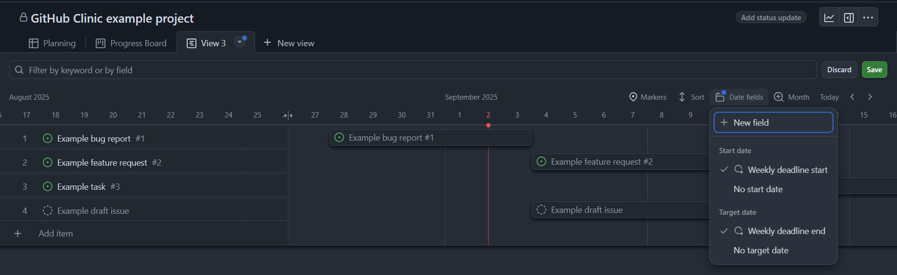
5.  Rename this view to **Timeline** and save your view.\
    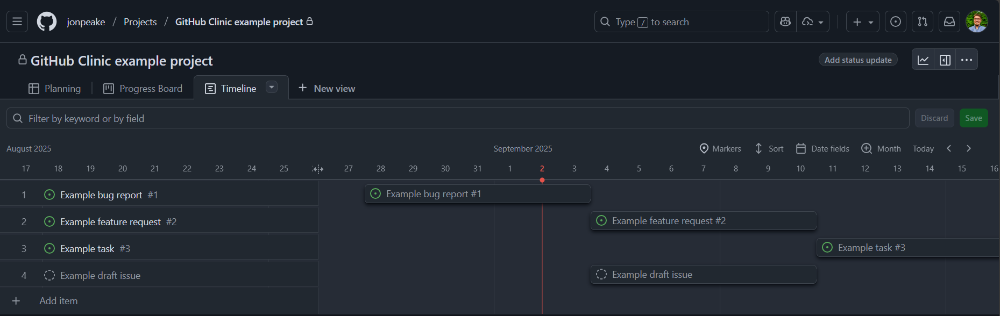
6.  Feel free to experiment with the different view types and features available with Projects. Check out [GitHub's documentation for Projects](https://docs.github.com/en/issues/planning-and-tracking-with-projects/learning-about-projects/about-projects) (be sure to look at the different sub-pages on the right-hand side of the page) for more information, tips, and tricks about GitHub Projects.\
    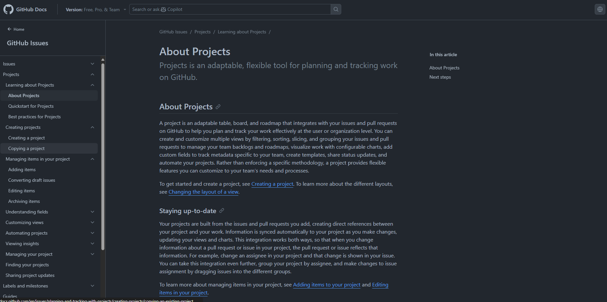