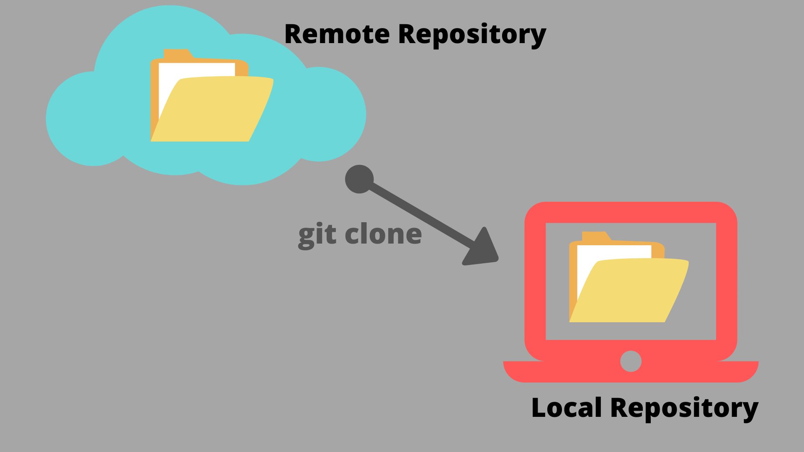

## Why clone a repository?

- GitHub is great for small changes

- Cloning allows you to work locally for complex changes involving multiple files

- Work on repos from any local machine

- Use the command line or your favorite IDE for Git actions

{alt="Image credit: https://jaisriram.hashnode.dev/how-to-clone-a-github-repository-to-local-machine"}

## How to interact with local repositories

1.  Git Command Line - powerful, steeper learning curve
2.  GitHub Desktop - easier to pick up, familiar, but not as powerful
3.  RStudio - integrated into workflow, but clunky
4.  VSCode/Positron - integrated into workflow, less clunky, learning curve if coming from RStudio
5.  Other IDEs - YMMV

## How to Clone

1.  On GitHub, navigate to the main page of the repository.

2.  Above the list of files, click **Code**.

    {alt="Screenshot of the list of files on the landing page of a repository. The \"Code\" button is highlighted with a dark orange outline."}

3.  Copy the URL

4.  In command line: Type `git clone`, paste the URL you copied, and hit enter

    ```         
    git clone https://github.com/YOUR-USERNAME/YOUR-REPOSITORY
    ```

5.  In IDE or GH Desktop: find the clone function and paste the URL

## Working Locally: Git commands

- Clone: copy remote repo to local environment

- Pull: synchronize changes in remote repository to local

- Fetch: retrieve commit history, but doesn't sync changes

  - Good for review

- Push: send changes from local up to remote

## Working Locally: Git commands

- Stage: add changes to be committed

- Commit: save staged changes and record to history

  - Can also amend commits (but don't do this if you pushed the changes)

- Stash: temporarily save uncommitted changes

## Advanced Git commands

- Checkout: create or switch to a branch

- Merge: merge committed changes from a branch into another

- Rebase: pull changes from a remote into a local repository while "rewriting" the commit history